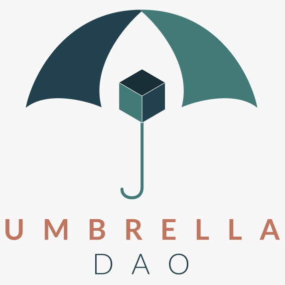

[![MIT License][license-shield]][license-url]

    
 

    
    <h3 align="center"> UmbrellaDAO repository </h3>
    

        Providing disenfranchised builders and social entrepreneurs access to web3 grant funding for public goods.
     
    <a href="https://github.com/pinajmr/UmbrellaDAO"><strong> Explore the docs » </strong></a>
    <h4><a href="https://polygonscan.com/address/0xC713d459f81C7C5fcB67Ed32f1D6950Bfc3458F0"><strong>  Link to the deployed UmbrellaDAO smart contract on Polygonscan» </strong></a></h4>
    <h4><a href="https://polygonscan.com/address/0x6910CE71e784bE5B35183B2ECf2419dC6033d9E4"><strong>  Link to the deployed Token Governor Umbrella smart contract on Polygonscan with more 2+ transaction» </strong></a><h4>
    <h4>
    <a href="https://twitter.com/pinajmr/status/1579093189847572480"><strong>  Link to the what we’re building #onPolygon @0xPolygonDevs on twitter for Jose Pina » </strong></a></h4>
    <h4><a href="https://twitter.com/carlosjmelgar/status/1579095193697267714"><strong>  Link to the what we’re building #onPolygon @0xPolygonDevs on twitter for Carlos Melgar » </strong></a>
    
</h4>

 

  
Table of Contents

  <ol>
    <li>
      <a href="#sobre-el-proyecto">About the project</a>
      <ul>
        <li><a href="#construido-con">Built with</a></li>
      </ul>
    </li>
    <li>
      <a href="#empezando">Getting Started</a>
      <ul>
        <li><a href="#prerequisitos">Prerequisites</a></li>
        <li><a href="#instalacion">Installation</a></li>
      </ul>
    </li>
    <li><a href="#usage">Usage</a></li>
    <li><a href="#roadmap">Roadmap</a></li>
    <li><a href="#licencia">License</a></li>
    <li><a href="#autores">Contact</a></li>
  </ol>

## About the project 

UmbrellaDAO combines L2, DAO tooling, POKT Network to empower disenfranchised developers and social entrepreneurs in their search for grant funding. 

Disenfranchised people in LatAm and other emerging regions are unable to participate in web3 grant funding that requires KYC. This prevents builders from creating public goods in regions where it’s most needed, inhibits upward mobility for disadvantaged developers and social entrepreneurs while creating an environment where web3 empowers the people in higher social and economic classes and they empower other members of those classes. 

In order for the industry to achieve impactful mass adoption, local leaders who have experienced and understand local obstacles should be supported so they can empower teams to build in their communities and level the playing field instead of creating more disadvantages for the underprivileged.

Examples: 
People in rural or marginalized communities without physical addresses.
Unbanked individuals and teams who are unable to incorporate. 
Developers who are undocumented immigrants in first world countries. 

Solution: 
Create an umbrella organization that vets teams, quantifiable impact/ progress, feasibility and serves as a proxy for grant applications and distributes finding based on milestones. 

(<a href="#readme-top">back to top</a>)

### Built with

This project uses POCKET Network and Polygon.

We use that we believe in decentralization, there is not much effort to convince us to use it.

Polygon, without a doubt the most used second layer network, where our users interested in this project, is the one they use the most for their interactions.

Many disenfranchised developers and social entrepreneurs throughout LatAm are unable to access grant funding to support their public goods projects due to obstacles relating to geographic marginalization and socio-economic backgrounds. By creating UmbrellaDAO, we are enabling them to create public goods where they are most needed. The UmbrellaDAO allows disadvantaged builders to apply for grants and distributes funds based on milestones. 

UmbrellaDAO enables access to grant funding for the disenfranchised by vetting and representing individuals and teams unable to pass KYC due to marginalization and socio-economic status. Low transaction fees, existing DAO tooling like Aragon and ex Honduran communities like Utila have already enabled Polygon for everyday use in to integrated and existing onboarding and payment options in Honduras is using Polygon.  

* 
* 
* 
* 
* 

(<a href="#readme-top">back to top</a>)

<!-- LICENSE -->
## License

Distributed under the MIT license. See `LICENSE.txt` for more information.

(<a href="#readme-top">back to top</a>)

## Contact

👤 **José Piña**

- GitHub: [@pinajmr](https://github.com/pinajmr)
- Twitter: [@pinajmr]( https://twitter.com/pinajmr)
- LinkedIn: [José Piña](https://www.linkedin.com/in/pinajmr/)

(<a href="#readme-top">back to top</a>)

[license-shield]: https://img.shields.io/github/license/othneildrew/Best-README-Template.svg?style=for-the-badge
[license-url]: https://github.com/othneildrew/Best-README-Template/blob/master/LICENSE.txt
